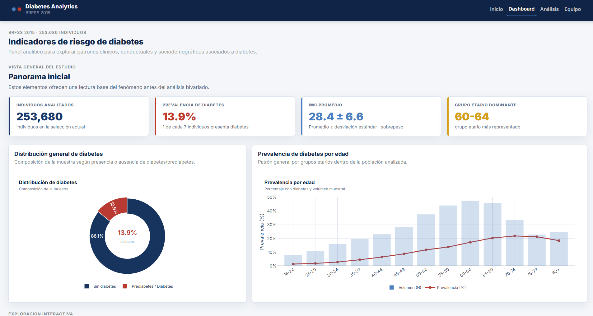

# Diabetes Analytics Dashboard · BRFSS 2015

Este proyecto desarrolla un dashboard interactivo desarrollado con **Dash**, **Plotly** y **Dash Bootstrap Components** para el análisis exploratorio de datos (EDA) enfocado en indicadores de salud y factores asociados a la diabetes en la población adulta de Estados Unidos.

A partir del dataset BRFSS 2015, se construye una herramienta visual que permite identificar patrones, analizar relaciones entre variables clínicas, conductuales y sociodemográficas, y facilitar la interpretación de la información mediante visualizaciones interactivas.

El enfoque del proyecto es descriptivo y analítico, orientado a la exploración de datos y generación de insights.

---

## Vista general



---

## Contexto

La diabetes es una de las enfermedades crónicas más relevantes a nivel global, con un impacto significativo en la calidad de vida y en los sistemas de salud. Su desarrollo está influenciado por múltiples factores, incluyendo hábitos de vida, condiciones clínicas y características sociodemográficas.

En este contexto, el análisis exploratorio de datos permite comprender mejor la distribución de la enfermedad y detectar relaciones que pueden ser relevantes para su estudio y prevención.

---

## Dataset

El dataset utilizado corresponde a la encuesta **Behavioral Risk Factor Surveillance System (BRFSS) 2015**, disponible en Kaggle:

https://www.kaggle.com/datasets/alexteboul/diabetes-health-indicators-dataset

### Instrucciones para el dataset: 

1. Ingresar al enlace anterior.

2. Descargar el dataset (requiere cuenta en Kaggle).

3. Al descomprimir, encontrarás 3 archivos CSV.

4. **Usar únicamente el siguiente archivo:**

-**diabetes_binary_health_indicators_BRFSS2015.csv**

5. Ubicar el archivo dentro de la carpeta `data/` del proyecto.

---

## Estructura del proyecto

```text
diabetes_dash_pr/
│
├── data/
│   ├── metadata/
│   │   └── data_dictionary.csv
│   └── processed/
│       └── diabetes_clean.csv        ← CSV procesado usado por la app
│
├── notebooks/
│   └── EDA_DIABETES.ipynb            ← Notebook del análisis exploratorio
│
├── dash_app/
│   ├── assets/
│   │   ├── styles.css                ← Estilos visuales personalizados
│   │   ├── Daniela.jpeg              ← Imagen de equipo
│   │   └── Valeria.jpeg              ← Imagen de equipo
│   ├── callbacks/
│   │   ├── dashboard_callbacks.py    ← Lógica interactiva del dashboard
│   │   └── navigation_callbacks.py   ← Comportamiento de la navegación
│   ├── components/
│   │   ├── cards.py                  ← Tarjetas KPI del dashboard
│   │   ├── filters.py                ← Selector bivariado del dashboard
│   │   ├── kpis.py                   ← Componentes auxiliares de indicadores
│   │   ├── navbar.py                 ← Barra de navegación
│   │   └── tables.py                 ← Componentes tabulares
│   ├── layouts/
│   │   ├── home.py                   ← Página de inicio
│   │   ├── dashboard.py              ← Dashboard interactivo
│   │   ├── about.py                  ← Análisis, metodología y diccionario
│   │   └── team.py                   ← Página del equipo
│   ├── app.py                        ← Inicialización de Dash
│   └── index.py                      ← Punto de entrada y ruteo de páginas
│
├── src/
│   ├── data_loader.py                ← Carga y transformación del dataset
│   ├── preprocessing/
│   │   └── prepare_data.py           ← Preparación de datos
│   └── utils/
│       ├── figures.py                ← Figuras y visualizaciones Plotly
│       └── helpers.py                ← KPIs, tablas e información auxiliar
│
├── requirements.txt
├── README.md
└── .gitignore
```

---

## Instalación

1. Ubícate en la carpeta raíz del proyecto:

```bash
cd diabetes_dash_project
```

2. Crea y activa un entorno virtual:

```bash
# Windows
python -m venv venv
venv\Scripts\activate

# macOS / Linux
python3 -m venv venv
source venv/bin/activate
```

3. Instala las dependencias:

```bash
pip install -r requirements.txt
```

---

## Ejecución

Inicia el servidor local con:

```bash
python dash_app/index.py
```

Luego abre el navegador en:

```text
http://localhost:8050
```

Rutas principales:

```text
/            Inicio
/dashboard   Dashboard interactivo
/about       Análisis exploratorio y metodología
/team        Equipo del proyecto
```

---

## Funcionalidades

### Inicio

- Presenta el objetivo general del proyecto.
- Resume el contexto del análisis de diabetes y prediabetes.
- Incluye accesos hacia el dashboard y la sección de análisis exploratorio.
- Ofrece una lectura ejecutiva de los hallazgos para orientar la exploración.

### Dashboard

- Muestra KPIs principales: registros analizados, prevalencia de diabetes, IMC promedio con desviación estándar y grupo etario dominante.
- Incluye una vista general con distribución de diabetes y prevalencia por edad.
- Permite seleccionar una variable para compararla directamente contra `Diabetes_binary`.
- Adapta la visualización bivariada según el tipo de variable: binaria, ordinal o numérica.
- Agrega lectura dinámica del patrón observado para facilitar la interpretación.
- Muestra curva de densidad cuando la variable seleccionada es numérica.
- Incluye visualizaciones complementarias como ranking de factores asociados, boxplot de BMI por estado de diabetes y mapa de calor de correlación.

### Análisis

- Reúne la visión general del análisis en tabs: contexto, objetivos, propósito, metodología y marco teórico.
- Incluye el diccionario de datos con rol, tipo, codificación y descripción de cada variable.
- Integra el módulo interactivo de análisis univariado y bivariado en pestañas.
- Permite explorar la distribución individual de variables y comparar variables contra `Diabetes_binary` sin salir del mismo módulo.

### Equipo

- Presenta a las integrantes del proyecto.
- Incluye foto, perfil, aporte al proyecto y áreas de interés.
- Centraliza la información del equipo sin afectar el flujo analítico del dashboard.

---

## Tecnologías utilizadas

| Herramienta | Versión |
| --- | --- |
| Python | 3.10 o superior |
| Dash | 2.17.1 |
| Dash Bootstrap Components | 1.6.0 |
| Plotly | 5.22.0 |
| Pandas | 2.2.2 |
| NumPy | 1.26.4 |

---

## Notas del proyecto

- El archivo `src/data_loader.py` carga `data/processed/diabetes_clean.csv` y transforma variables codificadas a etiquetas legibles para la visualización.
- La lógica principal del dashboard está separada entre layouts, componentes, callbacks y utilidades de figuras.
- Las visualizaciones se construyen con Plotly y se integran en Dash mediante callbacks.
- El notebook `notebooks/EDA_DIABETES.ipynb` conserva el análisis exploratorio original que alimenta la interpretación del tablero.

---

## Equipo

-  **Daniela Hernández Navas** / Estudiante de Ciencia de Datos : Participó en la estructuración analítica del proyecto, el diseño de visualizaciones y la interpretación de patrones relacionados con diabetes y prediabetes.
-  **Valeria Incer Vergara** / Estudiante de Ciencia de Datos y Matemáticas : Contribuyó en la exploración del dataset, la organización metodológica y la construcción de una lectura clara y estructurada de los hallazgos.

---
